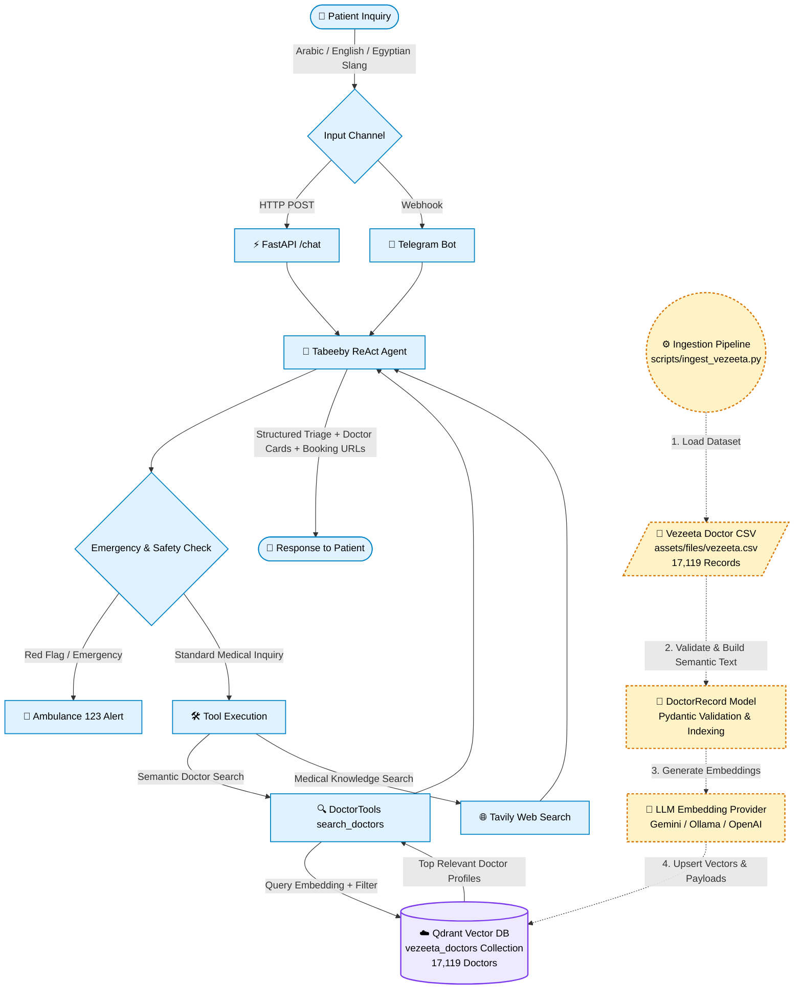

# 🩺 Tabeeby Agent (طبيبي) — Autonomous AI Medical Assistant & Doctor Finder

<p align="center">
  
  
  
  
  
  
</p>

---

## 🌟 Live Demo & Deployment

| Platform | Deployment Details | Link |
| :--- | :--- | :--- |
| **🤖 Telegram Bot** | Live Bot on **FastAPI Cloud** + **Qdrant Cloud** | 👉 [**@tabeeby_bot on Telegram**](https://t.me/tabeeby_bot) |
| **⚡ REST API Docs** | Live FastAPI Interactive Swagger / OpenAPI UI | 👉 [**https://tabeeby-agent.fastapicloud.dev/docs**](https://tabeeby-agent.fastapicloud.dev/docs) |

---

## 📌 Overview

**Tabeeby (طبيبي)** is an autonomous AI Medical Healthcare Navigator designed specifically for Egyptian and Middle Eastern healthcare contexts. Powered by the **Vezeeta** medical catalog of **17,000+ registered doctors**, Tabeeby bridges the gap between patient complaints (in English, Modern Standard Arabic, or Egyptian colloquial Arabic/slang) and verified specialist doctors.

### ✨ Key Capabilities
* **🧠 Smart Clinical Triage**: Intelligently deduces the required medical specialty (e.g. `"ضرس بيوجعني"` $\to$ **Dentistry**, `"وجع شديد في الصدر"` $\to$ **Cardiology**, `"تأخر حمل"` $\to$ **Reproductive Medicine & Infertility**).
* **🔍 Hybrid Vector Similarity & Metadata Filtering**: Embeds clinical features (**Specialty, Subspecialties, Symptoms, Title, and Medical Background**) into dense semantic vectors indexed in **Qdrant** (`vezeeta_doctors` collection), coupled with deterministic payload filtering on **Location/Area** and **Consultation Fee**.
* **🚑 Emergency Red Flag Protocols**: Instantly detects acute life-threatening symptoms (stroke, crushing chest pain, severe hemorrhage) and directs patients to emergency medical services (**Dial 123 in Egypt**).
* **🔗 Direct Booking Links**: Recommends verified doctors with direct Vezeeta booking URLs, fees in EGP, ratings, and exact clinic addresses.
* **🌐 Medical Web Search**: Leverages Tavily API for supplementary clinical lookups, rare condition explanations, and drug interaction inquiries.
* **💬 Omnichannel Availability**: Accessible via high-performance **FastAPI REST API** and interactive **Telegram Webhook Bot**.

---

## 🏗️ Architecture & Workflow

The system is architected into two decoupled subsystems:
1. **Offline Ingestion Pipeline (Separate Process)**: A standalone ETL batch pipeline that cleans, validates, embeds, and indexes doctor records into Qdrant (`vezeeta_doctors`). It runs independently on demand, during setup, or via scheduled jobs without affecting server uptime.
2. **Online Runtime Agent (FastAPI / Telegram)**: An autonomous ReAct reasoning agent that parses patient inquiries, performs clinical triage, executes vector search and web search tools, and formats grounded recommendations.



---

## 📂 Project Structure

```text
Tabeeby-Agent/
├── .env.example                     # Centralized environment configuration template
├── README.md                        # Project documentation & guides
└── src/
    ├── Makefile                     # Make shortcuts for server launch & offline ingestion
    ├── app.py                       # FastAPI application & lifespan management
    ├── pyproject.toml               # Project dependencies & build configuration (uv)
    ├── uv.lock                      # Locked dependency tree
    ├── agent/
    │   ├── __init__.py
    │   └── agent.py                 # Autonomous ReAct Agent engine & reasoning loop
    ├── assets/
    │   ├── database/
    │   │   └── qdrant_db/           # Local embedded Qdrant database storage
    │   └── files/
    │       └── vezeeta.csv          # Vezeeta Egypt doctor catalog (~17K records)
    ├── helpers/
    │   ├── __init__.py
    │   └── config.py                # Pydantic Settings & environment variables loader
    ├── models/
    │   ├── __init__.py
    │   ├── doctor.py                # DoctorRecord model, data validation, & semantic builder
    │   └── enums/
    │       └── ResponseEnums.py     # Application response signal enums
    ├── prompts/
    │   └── prompt_templatet.py      # System prompts, clinical triage templates & guardrails
    ├── routes/
    │   ├── __init__.py
    │   ├── chat.py                  # POST /chat REST endpoint
    │   ├── telegram.py              # POST /telegram/webhook integration
    │   └── schemes/
    │       └── chat.py              # Request/Response Pydantic schemas for /chat
    ├── scripts/
    │   ├── README.md                # Documentation for offline batch scripts
    │   ├── __init__.py
    │   └── ingest_vezeeta.py        # Standalone offline ETL & Qdrant ingestion script
    ├── stores/
    │   ├── llm/                     # LLM provider factory & interfaces (Gemini, OpenAI, Ollama)
    │   └── vectordb/                # Qdrant Vector DB provider & filter builder
    └── tools/
        ├── __init__.py
        ├── search_doctors.py        # DoctorTools semantic & hybrid search tool
        ├── web_tools.py             # Tavily medical knowledge search tool
        ├── memory.py                # File & memory helper tools
        └── helpers.py               # Tool helper utilities
```

---

## ⚙️ Prerequisites & Requirements

* **Python**: `3.10` or higher
* **Package Manager**: [`uv`](https://github.com/astral-sh/uv) (recommended) or `pip`
* **Vector Database**: [Qdrant Cloud](https://cloud.qdrant.io) cluster or local embedded Qdrant (`assets/database/qdrant_db`)
* **LLM & Embedding Provider**: [Google AI Studio](https://aistudio.google.com/) API Key (Gemini), OpenAI API Key, or local [Ollama](https://ollama.com/) instance

---

## 🚀 Quickstart & Installation

### 1. Clone the Repository
```bash
git clone https://github.com/amr10w/Tabeeby-Agent.git
cd Tabeeby-Agent
```

### 2. Set Up Virtual Environment & Dependencies

Using **`uv`** (Recommended):
```bash
cd src
uv venv
source .venv/bin/activate   # On Windows: .venv\Scripts\activate
uv sync
```

Using **Standard `pip`**:
```bash
cd src
python3 -m venv .venv
source .venv/bin/activate   # On Windows: .venv\Scripts\activate
pip install -e .
```

---

## 🔑 Environment Configuration

Create a `.env` file inside the `src/` directory (or copy from root `.env.example`):

```ini
# Application Identity
APP_NAME=Tabeeby
APP_VERSION=1.0.0

# LLM Generation Configuration
GENERATION_BACKEND=GEMINI
GENERATION_MODEL_ID=gemini-2.5-flash
GENERATION_DAFAULT_MAX_TOKENS=1500
GENERATION_DAFAULT_TEMPERATURE=0.1
INPUT_DAFAULT_MAX_CHARACTERS=1000

# Provider API Keys
GEMINI_API_KEY=your_gemini_api_key_here
OPENAI_API_KEY=your_openai_api_key_here
OPENAI_API_URL=https://api.openai.com/v1
GROQ_API_KEY=your_groq_api_key_here
GROQ_API_URL=https://api.groq.com/openai/v1
OLLAMA_API_URL=http://localhost:11434

# Embedding Configuration
EMBEDDING_BACKEND=GEMINI
EMBEDDING_MODEL_ID=text-embedding-004
EMBEDDING_MODEL_SIZE=768

# Vector Database (Qdrant)
VECTOR_DB_BACKEND=QDRANT
VECTOR_DB_PATH=qdrant_db
VECTOR_DB_DISTANCE_METHOD=cosine
VECTOR_DB_COLLECTION_NAME=vezeeta_doctors
VECTOR_DB_URL=https://your-cluster-id.aws.cloud.qdrant.io
VECTOR_DB_API_KEY=your_qdrant_api_key_here

# Optional: Medical Web Search (Tavily)
TAVILY_API_KEY=your_tavily_api_key_here

# Optional: Telegram Webhook Bot
TELEGRAM_BOT_TOKEN=your_telegram_bot_token_here
TELEGRAM_WEBHOOK_URL=https://your-domain.com/telegram/webhook
```

---

## 🗄️ Offline Data Ingestion & Indexing (Separate Process)

> [!NOTE]
> **Data ingestion runs as an isolated, standalone process.** It embeds and populates the `vezeeta_doctors` collection in Qdrant before launching the API server, or when refreshing doctor records.

Run the ingestion script from the `src/` directory:

### Option 1: Using `make`
```bash
# Full ingestion with collection reset (recreates 'vezeeta_doctors' collection)
make ingest

# Incremental ingestion (without resetting collection)
make ingest_default
```

### Option 2: Using `uv run` / Python Module
```bash
# Full ingestion with collection reset (recommended for initial setup)
uv run python -m scripts.ingest_vezeeta --batch-size 64 --reset

# Incremental ingestion
uv run python -m scripts.ingest_vezeeta --batch-size 64

# Run with verbose / debug logging
uv run python -m scripts.ingest_vezeeta --verbose
```

---

## 🖥️ Running the Application

### 1. Launch the FastAPI Server

From the `src/` directory:

```bash
# Using Make
make app

# Or using Uvicorn directly
uv run uvicorn app:app --host 0.0.0.0 --port 8000 --reload
```

* **Local Swagger Docs**: [http://127.0.0.1:8000/docs](http://127.0.0.1:8000/docs)
* **Live Production Swagger Docs**: [https://tabeeby-agent.fastapicloud.dev/docs](https://tabeeby-agent.fastapicloud.dev/docs)
* **Health Check**: `GET http://127.0.0.1:8000/` or `GET https://tabeeby-agent.fastapicloud.dev/`

---

## 📡 API Usage & Examples

### 🔍 Chat Endpoint (`POST /chat`)

You can test either the **live deployed endpoint** or your **local instance**:

#### Live Cloud Endpoint:
```bash
curl -X 'POST' \
  'https://tabeeby-agent.fastapicloud.dev/chat' \
  -H 'Content-Type: application/json' \
  -d '{
  "prompt": "عايز دكتور نساء وتوليد شاطر في حدائق القبة وسعره معقول",
  "chat_history": [],
  "total_cost": 0
}'
```

#### Local Endpoint:
```bash
curl -X 'POST' \
  'http://127.0.0.1:8000/chat' \
  -H 'Content-Type: application/json' \
  -d '{
  "prompt": "عايز دكتور نساء وتوليد شاطر في حدائق القبة وسعره معقول",
  "chat_history": [],
  "total_cost": 0
}'
```

---

## 🤖 Telegram Bot Integration

Tabeeby seamlessly integrates with Telegram for on-the-go patient accessibility:

1. Create a bot using [@BotFather](https://t.me/BotFather) on Telegram and obtain your `TELEGRAM_BOT_TOKEN`.
2. Deploy the app (or expose your local port with Cloudflare Tunnels/ngrok) and set `TELEGRAM_WEBHOOK_URL` in `.env`.
3. On startup, FastAPI automatically registers the webhook with Telegram.
4. **Commands Supported**:
   - `/start` — Welcome message and session initialization.
   - `/reset` — Clears conversation history and restarts context.
5. Try the live bot directly on Telegram: [**@tabeeby_bot**](https://t.me/tabeeby_bot).

---

## 🛡️ Medical Disclaimer & Safety Protocols

> [!IMPORTANT]
> **Tabeeby is an AI-powered clinical navigation and doctor discovery assistant, NOT a licensed physician.**
> * It does **not** provide definitive clinical diagnoses or prescribe controlled pharmaceutical medications.
> * If experiencing emergency red flags (severe chest pain, difficulty breathing, stroke symptoms, major trauma, uncontrolled bleeding), patients are instructed to immediately dial **123 (Ambulance in Egypt)** or visit the nearest emergency room.

---

## 📄 License & Author

* **Author**: Amr Walid ([@amr10w](https://github.com/amr10w)) — [amrw5189@gmail.com](mailto:amrw5189@gmail.com)
* **Dataset & Source**: Vezeeta Egypt Medical Directory
* **License**: MIT License
